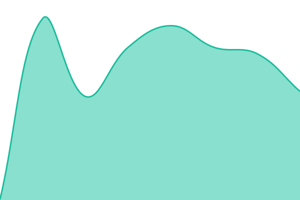

# [📈 Live Status](https://demo.upptime.js.org): <!--live status--> **🟩 All systems operational**

This repository contains the open-source uptime monitor and status page for [周恭煥](zhiu.dev), powered by [Upptime](https://github.com/upptime/upptime).

With [Upptime](https://upptime.js.org), you can get your own unlimited and free uptime monitor and status page, powered entirely by a GitHub repository. We use [Issues](https://github.com/kenchou2006/upptime/issues) as incident reports, [Actions](https://github.com/kenchou2006/upptime/actions) as uptime monitors, and [Pages](https://demo.upptime.js.org) for the status page.

<!--start: status pages-->
<!-- This summary is generated by Upptime (https://github.com/upptime/upptime) -->
<!-- Do not edit this manually, your changes will be overwritten -->
<!-- prettier-ignore -->
| URL | Status | History | Response Time | Uptime |
| --- | ------ | ------- | ------------- | ------ |
|  [Page](zhiu.dev) | 🟩 Up | [page.yml](https://github.com/kenchou2006/upptime/commits/HEAD/history/page.yml) | 

 303ms
     
 | 

<a href="https://uptime.zhiu.dev/history/page">100.00%</a>
    

|  [Blog](blog.zhiu.dev) | 🟩 Up | [blog.yml](https://github.com/kenchou2006/upptime/commits/HEAD/history/blog.yml) | 

 313ms
     
 | 

<a href="https://uptime.zhiu.dev/history/blog">100.00%</a>
    

|  [Short Link](l.zhiu.dev/healthz) | 🟩 Up | [short-link.yml](https://github.com/kenchou2006/upptime/commits/HEAD/history/short-link.yml) | 

 567ms
     
 | 

<a href="https://uptime.zhiu.dev/history/short-link">100.00%</a>
    

|  [Cloud Drive](cloud.zhiu.dev) | 🟩 Up | [cloud-drive.yml](https://github.com/kenchou2006/upptime/commits/HEAD/history/cloud-drive.yml) | 

 587ms
     
 | 

<a href="https://uptime.zhiu.dev/history/cloud-drive">100.00%</a>
    

<!--end: status pages-->

[**Visit our status website →**](https://demo.upptime.js.org)

## 📄 License

- Powered by: [Upptime](https://github.com/upptime/upptime)
- Code: [MIT](./LICENSE) © [Anand Chowdhary](https://anandchowdhary.com), supported by [Pabio](https://pabio.com)
- Data in the `./history` directory: [Open Database License](https://opendatacommons.org/licenses/odbl/1-0/)
